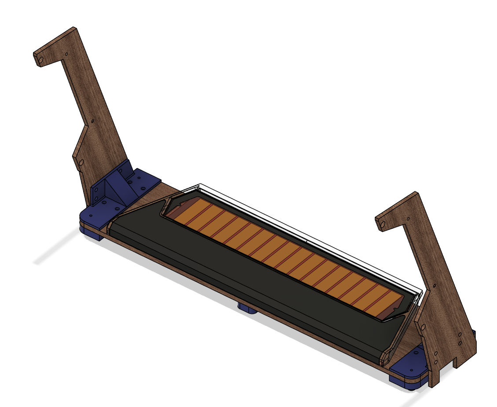
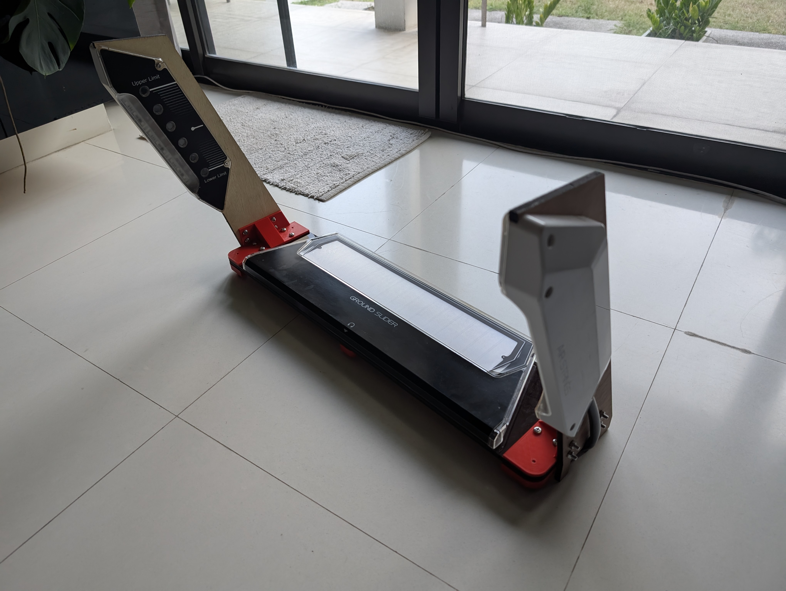
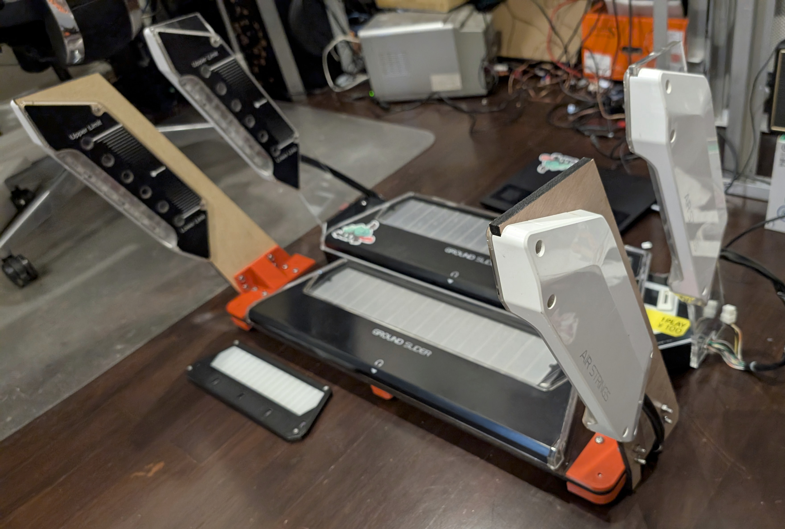

# Chunithm Lasercut and 3D printed assembly to hold your arcade slider and air sensors

This is a lasercutted and 3D printed case for a standalone arcade slider and air side devices.

## Notes
- Requires a lasercutter with a bed size of at least 800x200 mm
- Requires a 3D Printer
- Around the same size as a real panel.
- The current design does not have any mounting holes for the slider (sorry)
  so you will need to mark and drill your own mounting holes.
- You can use any material as long as it's strong enough and has the correct thickness.
- You can also stack different thicknesses of materials to make it thick enough.
- For wiring the slider and the airs, go to the [wiki](https://rhythm-cons.wiki/w/Chunithm).

## Thanks
Thanks to Moldypie and mon for their arcade slider cases and the air sensor mounting dimensions.

## Materials
- 8mm thick material for air towers
- 8-10mm thick material for the plate
- (OPTIONAL) 1mm decorative acrylic sheet
- 16x M6x25 Screws
- 16x M6 Nuts
- 4x M5x18 Screws
- 6x M4x35 Screws
- 6x M4 Nuts
- 6x 25x32x20mm Rubber Feet (doesn't have to be exactly the same)

## Lasercut Parts
| Amount  | Filename  |   Notes   |
| ------------- | ------------- | ------------- |
|1|         `plate.dxf`         |8-10mm Material|
|1|         `plate.dxf`         |1mm Black Acrylic (OPTIONAL Decorative plate)|
|2|         `tower.dxf`          | 8mm Material |

## 3D Printed Parts
| Amount  | Filename  |   Notes   |
| ------------- | ------------- | ------------- |
|1|         `left_tower_top.stl`         ||
|1|         `left_tower_bottom.stl`          ||
|1|         `right_tower_top.stl`         ||
|1|         `right_tower_bottom.stl`          ||
|2|         `feet_spacer.stl`          ||

## Final Product
For my slider, I used plywood and 1mm black acrylic.

